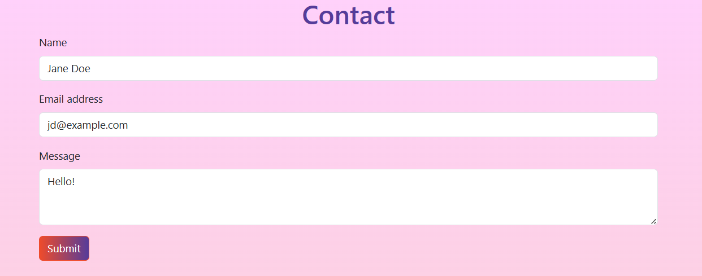

# React Portfolio
## Description:
Single-page web application that functions as a place to share projects as well as a place to connect and collaborate with fellow developers.

## Table of Contents:
- [Technologies](#technologies)
- [Installation](#installation)
- [Usage](#usage)
- [Questions](#questions)

## Technologies:
- JavaScript
- React
- [Bootstrap](https://getbootstrap.com/)
- CSS
- [Netlify](https://www.netlify.com/)

## Installation:
View the deployed application at <https://kayla-engelstad-portfolio.netlify.app/>.

## Usage:
- Use the navigation bar to view each section.  

- Read a short bio in the 'About Me' section.

- View my deployed projects in the 'Portfolio' section. The buttons will open tabs to either the Github repo or the deployed version of the corresponding project.  

- Enter valid contact information on the 'Contact' page.  

- View a list of my skills and download a pdf of my resume on the 'Resume' page.  

- The footer (following every section) will open tabs to my corresponding Github, Linkedin, and Stack Overflow profiles.  

## Questions:
Contact me via github: [kayla-e774](https://github.com/kayla-e774)  
Or email me at: <kengelstad16@gmail.com>